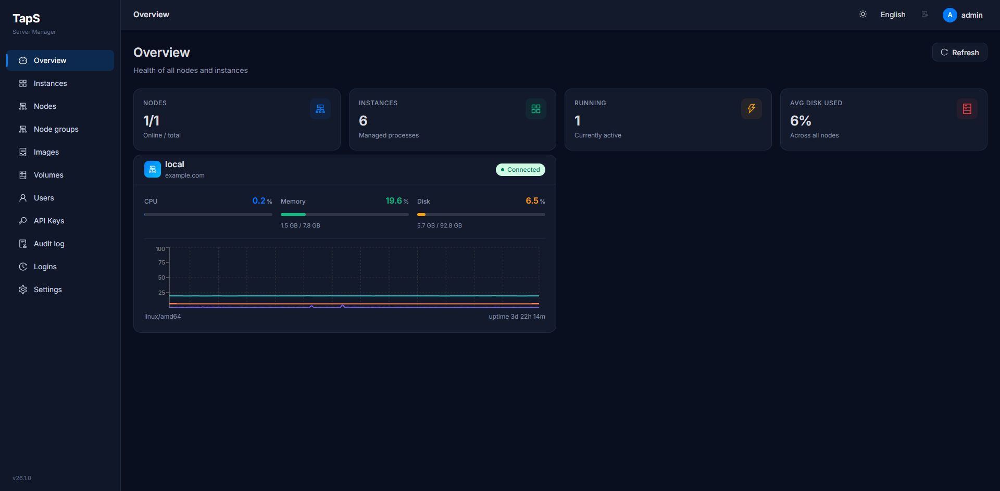
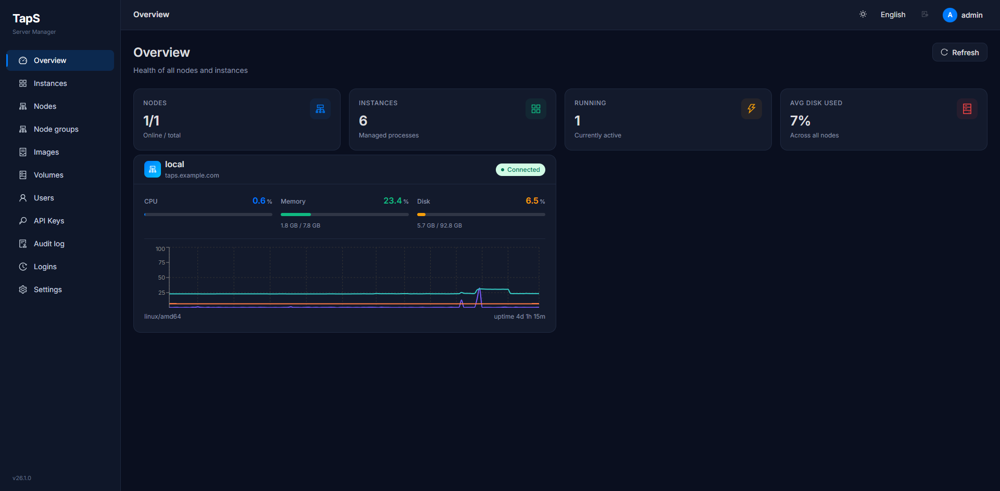
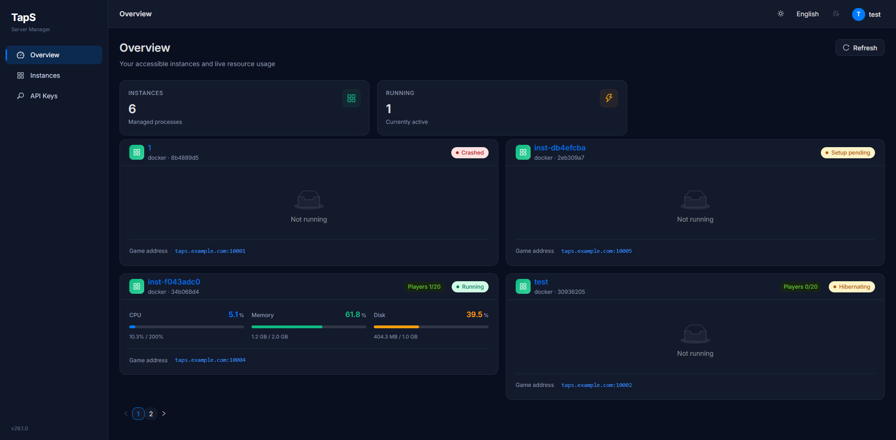
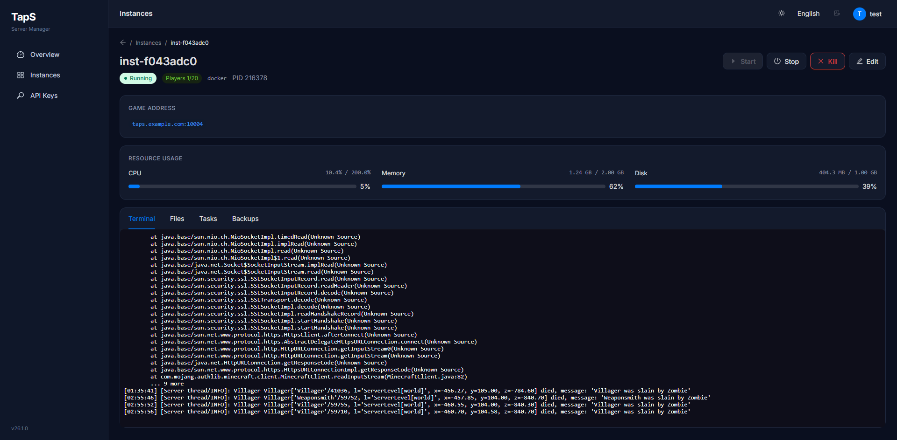
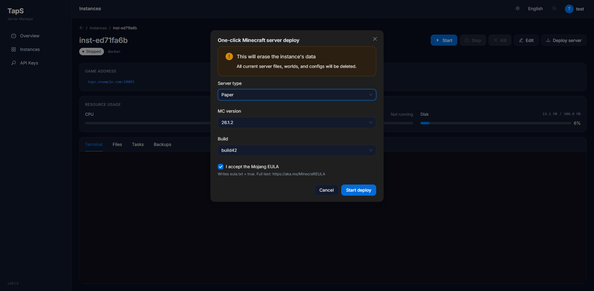

[English](README.md) | **中文** | [日本語](README.ja.md)

# TapS

开源游戏服务器管理面板 — 一个面板，托管所有游戏服务器。

TapS 采用 Panel + Daemon 双端架构，Panel 负责 Web UI 和集中管控，Daemon 部署在每台游戏宿主机上运行容器。支持 Minecraft Java / Bedrock / Terraria 以及任何 Docker 容器化进程的统一管理，提供真 PTY 终端、文件管理、备份还原、自动休眠、SSO 登录、多语言等现代游戏服管理体验。







## ✨ 功能特性

- **双端架构** — Panel（控制面 + Web UI）+ Daemon（宿主代理），WSS + TLS 指纹 pin 安全通信
- **实例管理** — Docker 容器实例，启停/重启/强制终止/状态监控，支持自动启动和崩溃自动重启
- **浏览器实时终端** — 基于 xterm.js + WebSocket 的真 PTY 终端，断线自动重连，本地行编辑 + Tab 补全
- **一键部署** — 内置 Vanilla / Paper / Purpur / Fabric / Forge / NeoForge 模板，选版本即部署
- **文件管理器** — 上传（分片协议）/下载/在线编辑/重命名/复制/移动/zip 压缩解压
- **备份还原** — 实例级 zip 快照，支持自定义备注，备份计入磁盘配额
- **托管卷** — loopback 固定大小卷，给每个实例独立的"硬盘"配额
- **资源监控** — 节点 CPU / 内存 / 磁盘实时仪表盘 + 历史曲线，单实例 Docker stats
- **自动休眠** — 空闲检测 → 自动停容器 → 假 SLP 监听器显示自定义 MOTD → 玩家连接即唤醒
- **节点分组** — 多节点负载调度，按"磁盘 ≥ 20% + 内存最低"自动选节点创建实例
- **计划任务** — cron 表达式，动作：发命令 / 启动 / 停止 / 重启 / 备份
- **用户与权限** — admin / user 角色，按实例粒度授权（查看/控制/终端/文件）
- **API Key** — `tps_` 前缀长期凭据，支持 IP 白名单 + Scope 限制 + 过期时间
- **SSO / OIDC** — 支持 Logto / Google / Microsoft / Keycloak 等任何标准 OIDC 提供商
- **登录验证码** — Cloudflare Turnstile / reCAPTCHA Enterprise
- **安全加固** — CSP / X-Frame-Options / SSRF 防护 / 路径穿越防护 / 速率限制 / graceful shutdown
- **多语言** — 中文 / English / 日本語（926 key 三语完全对齐）
- **暗色主题** — 全局深色 / 浅色一键切换
- **Docker 镜像管理** — 拉取/删除/自定义显示名称，支持 OCI label 自动读取

## 🏗️ 技术栈

| 组件 | 技术 |
|------|------|
| Panel 后端 | Go 1.25 + Gin + GORM + SQLite |
| Daemon 后端 | Go 1.25 + gorilla/websocket + Docker CLI |
| 前端 | React 18 + TypeScript + Vite 5 + Ant Design 5 |
| 状态管理 | Zustand（persist + partialize） |
| 国际化 | i18next（中/英/日 926 key） |
| 终端 | xterm.js + WebSocket |
| SSO | OpenID Connect（go-oidc + PKCE） |
| 加密 | AES-256-GCM（secrets at-rest）+ bcrypt（密码） |
| TLS | 自签 ECDSA 证书 + SHA-256 指纹 pin（Panel↔Daemon） |

## 🚀 快速开始

### 环境要求

- **Go** ≥ 1.25
- **Node.js** ≥ 18 + npm
- **Docker Engine**（Daemon 宿主机，用于运行游戏容器）
- **Linux**（Daemon 生产环境仅支持 Linux；macOS/Windows 可用于本地开发但功能降级）


### 快速安装（Linux）

```bash
# 一键安装（Panel + Daemon 同机部署）
curl -fsSL https://raw.githubusercontent.com/ProjectTapX/TapS/main/scripts/install.sh | bash
```

> 也可选择：[仅安装 Panel](scripts/install-panel.sh) | [仅安装 Daemon](scripts/install-daemon.sh) | [脚本文档](docs/zh/deployment/install-scripts.md)

### 从源码构建 & 部署

```bash
git clone https://github.com/ProjectTapX/TapS.git
cd TapS

# 1. 构建后端
bash scripts/build.sh
# 产物：dist/panel-linux-amd64、dist/daemon-linux-amd64、dist/web/

# 2. 部署到服务器
scp dist/panel-linux-amd64 dist/daemon-linux-amd64 root@server:/opt/taps/
scp -r dist/web root@server:/opt/taps/web

# 3. 在服务器上创建 systemd 服务并启动
# 详见 docs/deployment/single-host.md
```

> 本地开发环境搭建请参考 [从源码构建](docs/zh/development/build.md)。

### 配置说明

#### Panel 环境变量

| 配置项 | 说明 | 默认值 | 必填 |
|--------|------|--------|------|
| `TAPS_ADDR` | 监听地址 | `:24444` | 否 |
| `TAPS_DATA_DIR` | 数据目录（DB、密钥） | `./data` | 否 |
| `TAPS_WEB_DIR` | SPA 静态文件目录 | `./web` | 否 |
| `TAPS_ADMIN_USER` | 首次建库的管理员用户名 | `admin` | 否 |
| `TAPS_ADMIN_PASS` | 首次建库的管理员密码 | `admin` | 否 |
| `TAPS_TLS_CERT` | TLS 证书路径（直接 HTTPS） | — | 否 |
| `TAPS_TLS_KEY` | TLS 私钥路径 | — | 否 |

#### Daemon 环境变量

| 配置项 | 说明 | 默认值 | 必填 |
|--------|------|--------|------|
| `TAPS_DAEMON_ADDR` | 监听地址 | `:24445` | 否 |
| `TAPS_DAEMON_DATA` | 数据目录 | `./data` | 否 |
| `TAPS_REQUIRE_DOCKER` | 仅允许 Docker 实例 | `true` | 否 |

> 完整配置项列表（含 daemon config.json、系统设置 UI 可调参数）见 [docs/usage/settings.md](docs/usage/settings.md)

## 📖 使用说明

1. 登录后进入「**系统设置**」配置 **Panel 公开地址**（SSO / 终端 / CORS 的前置条件）
2. 在「**镜像**」页拉取所需的 Docker 镜像（如 `eclipse-temurin:21-jre`）
3. 在「**实例管理**」创建实例：选模板一键部署，或自定义 Docker 配置
4. 实例详情页可查看终端、管理文件、创建备份、设置定时任务

> 详细使用指南见 [docs/usage/quickstart.md](docs/usage/quickstart.md)

## 📁 项目结构

```
TapS/
├── packages/
│   ├── shared/                  # 共享模块
│   │   └── protocol/            #   Panel↔Daemon WS RPC 消息结构
│   │   └── ratelimit/           #   通用 IP 限速桶
│   │   └── tlscert/             #   自签证书生成 + 指纹工具
│   ├── panel/                   # Panel 后端
│   │   ├── cmd/panel/           #   启动入口 + CLI（reset-auth-method）
│   │   └── internal/
│   │       ├── api/             #     全部 HTTP handler + 路由 + 中间件
│   │       ├── auth/            #     JWT + API Key + bcrypt + 中间件
│   │       ├── sso/             #     OIDC 流程 + PKCE store + state
│   │       ├── model/           #     数据库模型（User/Daemon/Task/...）
│   │       ├── store/           #     SQLite 打开 + 迁移 + seed
│   │       ├── config/          #     环境变量加载
│   │       ├── daemonclient/    #     WS 连接 daemon + 重连 + 指纹 pin
│   │       ├── alerts/          #     Webhook 派发 + SSRF 防护
│   │       ├── netutil/         #     ClassifyHost + SafeHTTPClient
│   │       ├── secrets/         #     AES-GCM 加密
│   │       ├── captcha/         #     Turnstile + reCAPTCHA 验证
│   │       ├── scheduler/       #     cron 任务调度
│   │       ├── loglimit/        #     日志容量限制
│   │       ├── monitorhist/     #     监控历史采样
│   │       └── serverdeploy/    #     Paper/Vanilla 等 JAR provider
│   └── daemon/                  # Daemon 后端
│       ├── cmd/daemon/          #   启动入口
│       └── internal/
│           ├── rpc/             #     WS RPC server + HTTP 文件接口
│           ├── instance/        #     实例生命周期（docker run / pty / 重启）
│           ├── docker/          #     Docker CLI 封装（list/pull/remove/stats）
│           ├── fs/              #     虚拟文件系统（mount + Resolve + symlink 防护）
│           ├── backup/          #     zip 备份/还原 + 路径校验
│           ├── volumes/         #     loopback 卷管理（mkfs + mount）
│           ├── hibernation/     #     自动休眠（SLP poller + 假服务器 + 唤醒）
│           ├── uploadsession/   #     分片上传会话管理
│           ├── config/          #     环境变量 + config.json
│           └── deploy/          #     服务端部署（下载 + 安装 jar）
├── web/                         # React 前端
│   ├── src/
│   │   ├── i18n/                #   翻译文件（zh.ts / en.ts / ja.ts）
│   │   ├── pages/               #   页面组件（login/dashboard/instances/...）
│   │   ├── components/          #   通用组件（Terminal/FileManager/PullProgress/...）
│   │   ├── api/                 #   API 调用层（client.ts / resources.ts / docker.ts）
│   │   ├── stores/              #   Zustand 状态（auth / brand / prefs）
│   │   ├── layouts/             #   AppLayout（侧边栏 + 顶栏）
│   │   ├── utils/               #   工具函数（waitFor 等）
│   │   └── data/                #   镜像预设列表
│   ├── vite.config.ts
│   └── package.json
├── scripts/
│   └── build.sh                 # 交叉编译脚本（linux/amd64 + arm64）
├── docs/                        # 项目文档（21 个 md）
├── .github/workflows/ci.yml     # GitHub Actions CI
├── CHANGELOG.md                 # 版本变更日志
├── CONTRIBUTING.md              # 贡献指南
└── LICENSE                      # GPL-3.0
```

## 🔧 开发

```bash
# 前端热更新
cd web && npm run dev

# i18n 对齐检查（CI 用）
node scripts/i18n-gap-check.js

# 交叉编译生产二进制
bash scripts/build.sh
# 产物：dist/panel-linux-{amd64,arm64}、dist/daemon-linux-{amd64,arm64}、dist/web/
```

### 代码结构简述

- **Panel** 所有路由在 `packages/panel/internal/api/router.go` 注册
- **Daemon** 所有 RPC action 在 `packages/daemon/internal/rpc/server.go` dispatch
- **共享协议** 在 `packages/shared/protocol/message.go`（InstanceConfig / Hello / Welcome / 所有 Action 常量）
- **前端路由** 在 `web/src/router.tsx`，页面组件在 `web/src/pages/`

## 📄 API 文档

100+ 端点的完整参考（含 curl 示例 + 响应示例 + 字段定义）：

- [API 概览](docs/api/overview.md) — 鉴权、错误格式、限频、CORS、安全 Header
- [端点参考](docs/api/endpoints.md) — 全部 HTTP / WebSocket 端点

## 📚 文档

**[📖 完整文档](docs/zh/README.md)** — 涵盖使用、部署、运维、开发、安全和 API 参考的完整指南。

| 文档 | 内容 |
|------|------|
| [快速上手](docs/usage/quickstart.md) | 首次登录、配置、创建实例 |
| [系统设置](docs/usage/settings.md) | 全部 17 个设置卡片详解 |
| [单机部署](docs/deployment/single-host.md) | Panel + Daemon 同机 |
| [Nginx 反代](docs/deployment/nginx-https.md) | HTTPS + 完整 nginx 配置 |
| [安全架构](docs/security/architecture.md) | 完整防御层清单 |
| [加固清单](docs/security/best-practices.md) | 上线前必做项 |
| [故障排查](docs/operations/troubleshooting.md) | 常见问题 |

## 🤝 贡献

欢迎提交 Issue 和 Pull Request。详见 [贡献指南](CONTRIBUTING.md)。

> 提交安全漏洞请发邮件至 **hi@mail.mctap.org**，不要公开 Issue。

## 📝 更新日志

见 [CHANGELOG.md](CHANGELOG.md)。

## 📜 开源协议

本项目使用 [GPL-3.0](LICENSE) 协议开源。
